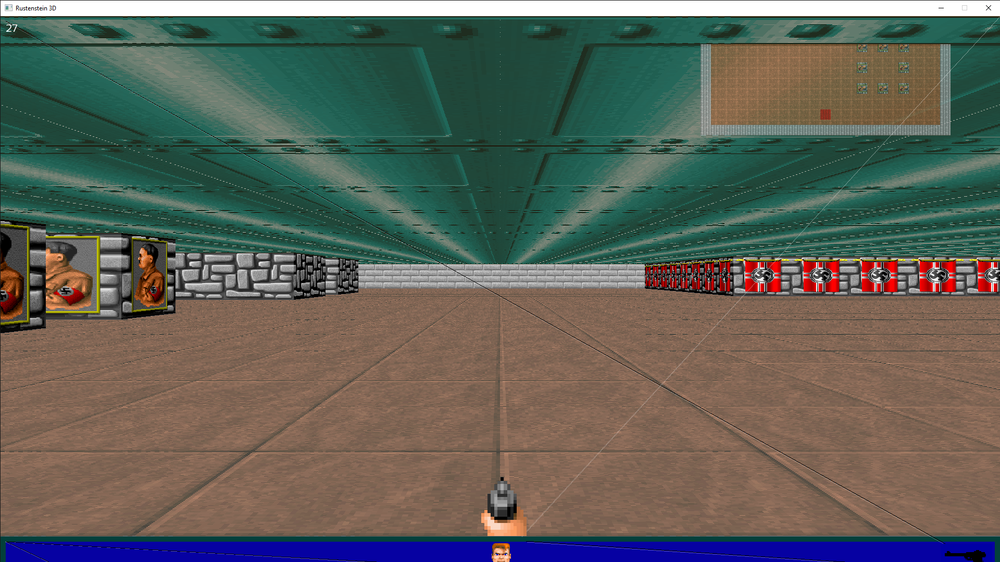

# Rustenstein3D

Simple Wolfenstein3D engine in rust.

## Build Instructions

1. Clone the repository
2. Set up the project with your operating system:
   1. Windows:
      1. Download [SFML2](https://www.sfml-dev.org/download/sfml/2.5.1/) and [CSFML2](https://www.sfml-dev.org/download/csfml/)
      2. Copy the `.lib` files from the `lib` folders in (C)SFML to your toolchain.
         - `C:\Users\[USERNAME]\.rustup\toolchains\[RUST_TOOLCHAIN]\lib\rustlib\[MSVC_TOOLCHAIN]\lib`
      3. Copy the `.dll` files from the `bin` folders in CSFML to the `target/release` folder.
   2. Macintosh:
      1. TODO
   3. Linux:
      1. Download [SFML2](https://www.sfml-dev.org/download/sfml/2.5.1/) and [CSFML2](https://www.sfml-dev.org/download/csfml/)
      2. Symlink the `libcsfml` static libraries to your `target/release` folder
3. Use `cargo run --release` to run `Rustenstein3D`.
   - Use `cargo run --release -- -w "[WIDTH]" "[HEIGHT]"` for a custom window size.
   - Use `cargo run --release -- --help` to view the full list of commands.

## Screenshot

