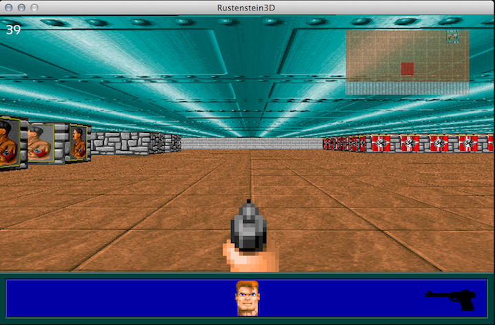

# Rustenstein3D

Simple Wolfenstein3D engine in rust.

## Build Instructions

1. Clone the repository
2. Run `cargo check` to pre-build the project
3. Windows:
   1. Download [SFML2](https://www.sfml-dev.org/download/sfml/2.5.1/) and [CSFML2](https://www.sfml-dev.org/download/csfml/)
   2. Copy the `.lib` files from the `lib` folders in (C)SFML to your toolchain.
      - `C:\Users\[USERNAME]\.rustup\toolchains\[RUST_TOOLCHAIN]\lib\rustlib\[MSVC_TOOLCHAIN]\lib`
   3. Copy the `.dll` files from the `bin` folders in CSFML to the `target/[debug/release]` folders.
4. Macintosh:
   1. TODO
5. Linux:
   1. TODO
6. Use `cargo run` to run Rustenstein3D.
   - Use `cargo run -- -w "[WIDTH]" "[HEIGHT]"` for a custom window size.

## Screenshot

